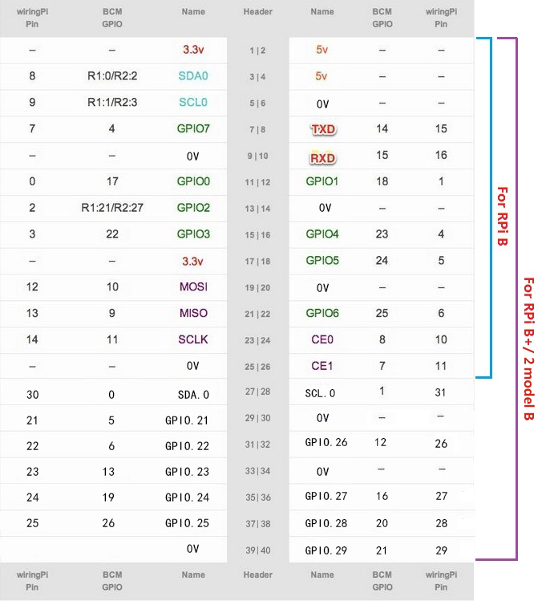

# raspberry-4b-car

主要目的是基于树莓派4B，将小车的python2到python3迁移改造，实现各种功能

## 部件配置

下面是树莓派的GPIO引脚映射图


参考这个图，确认不同部件的GPIO的引脚连线，需要注意参考[2. Basic Recipes — gpiozero 2.0.1 Documentation](https://gpiozero.readthedocs.io/en/latest/recipes.html#pin-numbering)，gpiozero使用BCM引脚（即板子上标识的GPIO xx引脚），下面的引脚指的是同一个

```python
>>> led = LED(17)
>>> led = LED("GPIO17")
>>> led = LED("BCM17")
>>> led = LED("BOARD11")
>>> led = LED("WPI0")
>>> led = LED("J8:11")
```

下面是另一种包括wiringPi的管脚对应图



我的小车的引脚配置如下所示，

| 部件   | 功能及示例程序                                    | BOARD引脚 | BCM/GPIO引脚 |
| ------ | ------------------------------------------------- | --------- | ------------ |
| 按钮   | 作为输入开关，启动或着关闭对应的功能              | 21        | 19           |
| buzz   | src/new/passive_buzzer.py，外接喇叭播放特定的音乐 | 11        | 17           |
| 红绿灯 | 板子上固定的红绿灯，可以作实验                    | 红25绿24  | 红6绿5       |
| 舵机   |                                                   |           |              |
| 云台   |                                                   |           |              |

## 任务

- [ ] 参考[Simple Guide to the Raspberry Pi GPIO Header - Raspberry Pi Spy](https://www.raspberrypi-spy.co.uk/2012/06/simple-guide-to-the-rpi-gpio-header-and-pins/)确认当前配置的每个部件在树莓派中GPIO的连接方式，填写上面的表格
- [ ] 使用gpiozero和wiringpi改造如下程序
  - [X] buzzer
  - [X] button
  - [ ] basic movement
